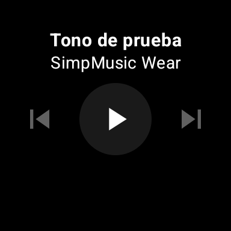
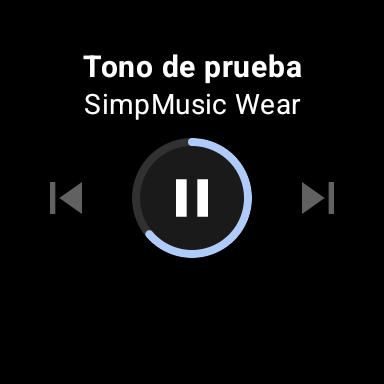

# SimpMusic para Wear OS — plan de implementación

Plan técnico para llevar [SimpMusic](https://github.com/maxrave-dev/SimpMusic) (cliente FOSS de YouTube Music) a un reloj con Wear OS como **app standalone**: música sin llevar el móvil encima.

> **Estado: F1 funcionando y verificado ejecutando.** En [`lab/`](lab/) hay un contenedor Docker que compila el core de SimpMusic, produce un APK de reloj, lo instala en un emulador de Wear OS y **reproduce audio real**. La decisión de arquitectura arriesgada (el puente `MediaController` → Horologist, [ADR 0003](docs/adr/0003-adapter-mediacontroller.md)) está demostrada, no supuesta.
>
> Las fases F2-F5 siguen siendo plan. Los fragmentos de Kotlin de `docs/ARCHITECTURE.md` describen la forma de la solución; el código que de verdad compila y corre está en `lab/wearApp/`.

## Documentos

| Documento | Contenido |
|---|---|
| [`docs/ARCHITECTURE.md`](docs/ARCHITECTURE.md) | Grafo de módulos, el puente `MediaController` → Horologist, API verificada, disposición de paquetes, supuestos a validar |
| [`docs/TESTING.md`](docs/TESTING.md) | Los dos entornos de depuración (emulador y reloj físico), pirámide de pruebas, checklist manual, recetas de `adb` |
| [`docs/REFERENCES.md`](docs/REFERENCES.md) | Todo lo verificado, con enlaces y fecha. Incluye lo que **no** se pudo confirmar |
| [`docs/adr/`](docs/adr/) | Cuatro decisiones de arquitectura, con alternativas descartadas y por qué |
| [**`lab/`**](lab/) | **El contenedor: toolchain, módulo `wearApp` compilable, y qué se validó ejecutando** |

## Demostrado, no supuesto

 

`PlayerScreen` de Horologist en una esfera de 384x384, alimentada por el puente, reproduciendo audio real (`state=PLAYING`, posición avanzando hasta los 8 s de la pista). Detalle y reproducibilidad en [`lab/README.md`](lab/README.md).

## La idea en una frase

Reutilizar el core de SimpMusic **intacto**, poner encima las pantallas ya hechas de **Horologist**, y unirlos con un puente de unas decenas de líneas.

## Por qué es abordable

El trabajo real es mucho menor de lo que parece porque casi todo existe ya:

| Pieza | De dónde sale | Coste |
|---|---|---|
| Scraper de YouTube, dominio, datos, servicio de reproducción | Core de SimpMusic, como submódulo | **0** — se consume tal cual |
| Pantalla de reproducción, volumen por corona, salida BT, navegación de catálogo, descargas offline | Horologist 0.7.15 | **0** — pantallas hechas |
| Manifest de reloj, config Gradle, login asistido por teléfono, tile, complicación | Fork [Rahyan/SimpMusic-WearOS](https://github.com/Rahyan/SimpMusic-WearOS) (50 ficheros, GPL) | **bajo** — adaptar, no escribir |
| Reglas ProGuard que arreglan carátulas en release | PR [#1864](https://github.com/maxrave-dev/SimpMusic/pull/1864), 82 líneas | **0** — copiar literal |
| **Puente entre el servicio y la UI** | **Escribir** | **la única pieza de diseño propia** |

Referencia de que la arquitectura funciona: [**cassette**](https://github.com/AdamNiederer/cassette), reproductor FOSS para Wear con Horologist 0.7.15 + Media3 + wear-compose 1.6.2 en producción.

## Restricciones que condicionan el diseño

- **Compose Multiplatform no tiene target de Wear OS.** La UI del reloj va en `androidx.wear.compose` obligatoriamente; `composeApp` no se reutiliza. Es el motivo de que haya UI nueva.
- **Sin altavoz útil:** la reproducción exige auriculares Bluetooth emparejados *al reloj*.
- **2 GB de RAM** en el hardware típico (3 GB en lo más reciente). De ahí el recorte de módulos del [ADR 0004](docs/adr/0004-alcance-recortado.md).
- **Distribución por sideload.** SimpMusic no puede estar en Play Store (términos de servicio de YouTube). En la práctica, para uso personal, basta la app *Wear APK Install* del reloj: sube el APK por navegador y lo instala el PackageInstaller nativo. Sin ADB.

## Fases

Cada fase termina en algo comprobable. La estimación es a tiempo completo.

### F0 · Andamiaje y entornos — 2-3 días
Fork propio de SimpMusic con el submódulo del core **pineado a un commit**. Módulo `:wearApp` nuevo, usando como plantilla el `build.gradle.kts` y el manifest del fork de Rahyan.

Montar **los dos entornos de depuración** (detalle en [`TESTING.md`](docs/TESTING.md)):
- **Emulador:** dos AVD de Wear OS (API 34 y 36, redondos), emparejados con un emulador de teléfono mediante el *Wear OS pairing assistant* de Android Studio.
- **Reloj físico:** wireless debugging para el día a día; *Wear APK Install* para builds sueltas.

**Salida:** un "hola mundo" de wear-compose corriendo en emulador y en el reloj, y el ciclo de iteración documentado en el README del fork.

### F1 · Que suene — 4-5 días ← el hito que valida el proyecto
`WearPlaybackService` reutilizando el stack `:media3` del core. El puente `PlaybackConnection` (ver [`ARCHITECTURE.md`](docs/ARCHITECTURE.md)) conectando `MediaController` con `PlayerRepositoryImpl`, y de ahí a `PlayerScreen` y `VolumeScreen`. Playlist fija para probar.

**Primera tarea del primer día:** comprobar que el scraper resuelve URLs de stream desde la red del reloj. Es el riesgo número uno y se descubre en horas, no en semanas.

**Pruebas:** unitarias del mapeo estado→UI; smoke instrumentado del arranque del servicio y play/pause.

**Salida:** una canción de YouTube Music suena por auriculares Bluetooth emparejados al reloj, con la corona controlando el volumen. **Si esto funciona, el resto es cuesta abajo.**

### F2 · Sesión y catálogo — 5-7 días
Login: portar el relay por Data Layer del fork de Rahyan (servicio en el reloj + actividad puente en el móvil). Fallback aceptable para uso personal: inyectar la sesión por `adb` en DataStore.

Biblioteca y playlists con `BrowseScreen` y `EntityScreen` sobre `:domain`. Búsqueda mínima con entrada de voz.

**Pruebas:** unitarias de los ViewModels; screenshot tests con Roborazzi en pantalla **redonda y cuadrada**.

**Salida:** navegar la biblioteca real y reproducir cualquier canción de ella.

### F3 · Offline — 3-4 días
`MediaDownloadService` de `horologist-media-data` con network-awareness (descargas solo por wifi). `PlaylistDownloadScreen` para gestionarlas.

**Pruebas:** instrumentada de descargar→reproducir; manual con **modo avión**.

**Salida:** salir a correr sin móvil y sin cobertura, y escuchar lo descargado.

### F4 · Endurecimiento — 2-3 días
Activar R8 con las reglas del PR #1864 copiadas literalmente, y **verificar carátulas y metadatos en release** — el fallo exacto que mató aquel PR. Perfilado en reloj real: memoria bajo reproducción, batería en una hora de streaming. Checklist manual completo.

**Salida:** APK de release firmado, instalado en el reloj, estable durante un día de uso normal.

### F5 · Opcional
Tile de acceso rápido y complicación en la esfera (ambos existen en el fork de Rahyan y en el ejemplo de Horologist). Más pantallas: artistas, podcasts. Afinado de la entrada rotatoria.

## Fuera de alcance, a propósito

Letras sincronizadas, vídeo, Spotify Canvas, SponsorBlock, ecualizador, Last.fm, Discord RPC, escucha compartida, insights. Todos son módulos Gradle independientes del core y varios ya tienen variante `-empty`: excluirlos es gratis. Razonado en el [ADR 0004](docs/adr/0004-alcance-recortado.md).

## Riesgos

| # | Riesgo | Mitigación |
|---|---|---|
| 1 | El scraper se comporta distinto desde la red del reloj | Probarlo el primer día de F1. Si falla, pivotar a offline-first |
| 2 | El puente `MediaController` → `PlayerRepositoryImpl` no produce estado correcto (nadie lo hace así todavía) | Plan C: implementar `PlayerRepository` a mano — 7 flujos y ~19 métodos |
| 3 | Choque entre Media3 1.11.0 del core y `horologist-media-data` | Bajar a 1.10.1, combinación que `cassette` demuestra |
| 4 | El core no cabe cómodo en 2 GB | Solo 5 módulos del core; medir en F4 y adelantar el recorte si aprieta |
| 5 | Deriva del upstream | Submódulo pineado; rebase solo cuando interese |

## Estimación

**Unas 3 semanas a tiempo completo** hasta F4, con música sonando al final de la primera. La UI nueva que realmente hay que escribir se reduce a pegamento y navegación, porque las pantallas vienen de Horologist y los patrones del fork de Rahyan.

## Licencias

SimpMusic y el fork de Rahyan son **GPL-3.0**: cualquier trabajo derivado hereda esa licencia. Horologist es Apache-2.0, compatible. `cassette` es **AGPL-3.0** — sirve como referencia de lectura, pero copiar su código arrastraría la AGPL.

---

*Plan redactado el 2026-08-31. Las verificaciones y sus fuentes están fechadas en [`docs/REFERENCES.md`](docs/REFERENCES.md).*
